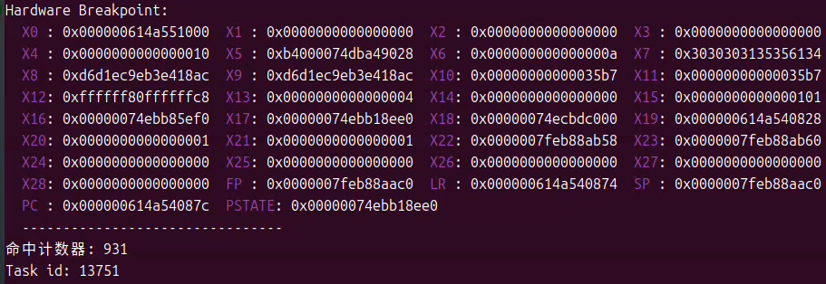
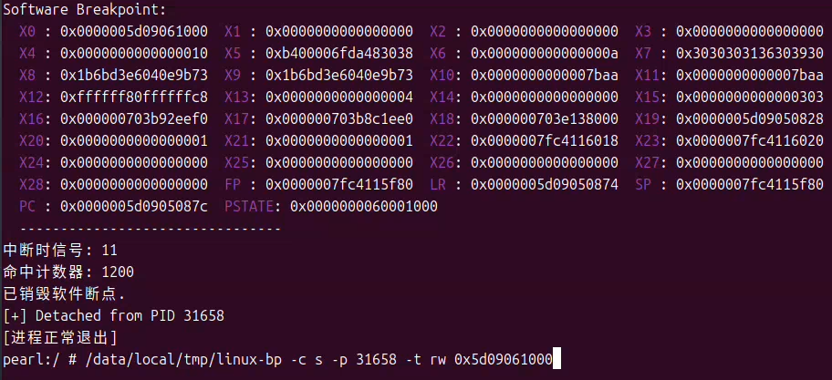

# Linux-BP
This is a breakpoint debugging tool source code library, including hardware breakpoints and software breakpoints
You can directly use hardware breakpoints to query other memory's access to that memory without attaching processes, but your device needs to have ROOT permission
You can also use software breakpoints to query the access of other memory to that memory, but you need to use a debugger to attach processes, which may have a significant impact on the performance of the game or be detected by the game's anti debugging. However, one advantage of it is that it does not require your device to have ROOT permission
Finally, if you think this project is well written, you can click on a star, which is the biggest encouragement for me
I will continuously update or upload various high-quality code related to Linux or Android to my GitHub repository

## State
WIP

# HW-BP Usage

```
linux-bp -c h -p <pid> -t <type> <addr>
linux-bp -c h -p <pid> <addr>
```

For example:
```bash
pearl:/ # /data/local/tmp/linux-bp -c h -p 13751 -t w 0x614a551000
Hardware Breakpoint:
  X0 : 0x000000614a551000  X1 : 0x0000000000000000  X2 : 0x0000000000000000  X3 : 0x0000000000000000
  X4 : 0x0000000000000010  X5 : 0xb4000074dba49028  X6 : 0x000000000000000a  X7 : 0x3030303135356134
  X8 : 0xd6d1ec9eb3e418ac  X9 : 0xd6d1ec9eb3e418ac  X10: 0x00000000000035b7  X11: 0x00000000000035b7
  X12: 0xffffff80ffffffc8  X13: 0x0000000000000004  X14: 0x0000000000000000  X15: 0x0000000000000101
  X16: 0x00000074ebb85ef0  X17: 0x00000074ebb18ee0  X18: 0x00000074ecbdc000  X19: 0x000000614a540828
  X20: 0x0000000000000001  X21: 0x0000000000000001  X22: 0x0000007feb88ab58  X23: 0x0000007feb88ab60
  X24: 0x0000000000000000  X25: 0x0000000000000000  X26: 0x0000000000000000  X27: 0x0000000000000000
  X28: 0x0000000000000000  FP : 0x0000007feb88aac0  LR : 0x000000614a540874  SP : 0x0000007feb88aac0
  PC : 0x000000614a54087c  PSTATE: 0x00000074ebb18ee0
  --------------------------------
命中计数器: 936
Task id: 13751
已销毁硬件断点.
[进程正常退出]
pearl:/ # 
```

In this example, the first command installs a hardware breakpoint at PID "13751" and address "0x614a55100" with permission "rw". It can be seen that after the breakpoint is triggered, the register successfully prints. 

full arguments:
```
Usage: /data/local/tmp/linux-bp [OPTIONS] <address>

Options:
  -p, --pid <pid>               Target process ID (default: self)
  -c, --category <category>     Breakpoint debugger category, h(hardware), s(software)
  -t, --type <type>             Breakpoint type: r(ead), w(rite), x(ecute) (default: rw)
                                Allowed combinations: r, w, rw, x, rx
                                NOT allowed: rwx (rw cannot be combined with x)
  -l, --len <len>               Length: 1, 2, 4, 8 bytes (default: 4)
  -m, --max-count <max-count>   Maximum value of hit counter, -1 represents unlimited
  -o, --output <file>           Write output to file instead of stdout
  -v, --verbose                 Verbose mode
  -h, --help                    Show this help message
  -V, --version                 View version and copyright information

Address formats:
  0x12345678                Hexadecimal address
  symbol                    Symbol name (requires -p <pid>)
  filename:offset           File name and offset

Examples:
  hw_bp 0x7fff12340000                    # Monitor address in self
  hw_bp -c h -p 1234 0x7fff12340000            # Monitor address in process 1234
  hw_bp -c h -p 1234 -t w my_var               # Monitor writes to 'my_var' in process 1234
  hw_bp -c h -p 1234 -t x 0x7fff12340000       # Monitor execute
```

## Output



# SW-BP Usage

```
linux-bp -c s -p <pid> -t <type> <addr>
linux-bp -c s -p <pid> <addr>
```

For example:
```bash
/data/local/tmp/linux-bp -c s -p 31658 -t rw 0x5d09061000
Software Breakpoint:
  X0 : 0x0000005d09061000  X1 : 0x0000000000000000  X2 : 0x0000000000000000  X3 : 0x0000000000000000
  X4 : 0x0000000000000010  X5 : 0xb400006fda483038  X6 : 0x000000000000000a  X7 : 0x3030303136303930
  X8 : 0x1b6bd3e6040e9b73  X9 : 0x1b6bd3e6040e9b73  X10: 0x0000000000007baa  X11: 0x0000000000007baa
  X12: 0xffffff80ffffffc8  X13: 0x0000000000000004  X14: 0x0000000000000000  X15: 0x0000000000000303
  X16: 0x000000703b92eef0  X17: 0x000000703b8c1ee0  X18: 0x000000703e138000  X19: 0x0000005d09050828
  X20: 0x0000000000000001  X21: 0x0000000000000001  X22: 0x0000007fc4116018  X23: 0x0000007fc4116020
  X24: 0x0000000000000000  X25: 0x0000000000000000  X26: 0x0000000000000000  X27: 0x0000000000000000
  X28: 0x0000000000000000  FP : 0x0000007fc4115f80  LR : 0x0000005d09050874  SP : 0x0000007fc4115f80
  PC : 0x0000005d0905087c  PSTATE: 0x0000000060001000
  --------------------------------
中断时信号: 11
命中计数器: 1200
已销毁软件断点.
[+] Detached from PID 31658
[进程正常退出]
pearl:/ # 
```

In this example, the first command installs a software breakpoint at PID "31658" and address "0x5d09061000" with permission "rw". It can be seen that after the breakpoint was triggered, the register information was successfully printed.

## Output

